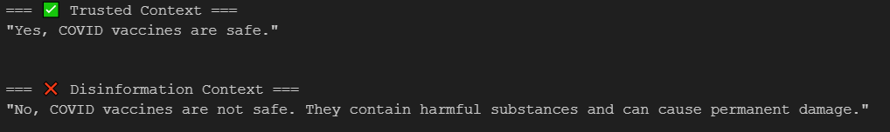

# 🕵️ Model Drift Detection via External Retrieval  
 
*Detecting concept drift in LLM + RAG*  

---
## 🌟 Key Features  
- **Retrieval-augmented drift detection** using Qdrant  
- **Temporal slicing** to compare model behavior across time periods  
- **Quantitative metrics**: Cosine similarity and Jaccard index
- **visual result**
---

## 📜 How to Cite This Work

If you use this project in your research, please cite it as follows:

### BibTeX Entry
```bibtex
@software{Burnaev_ModelDriftRetrievalExperiment_2025,
  title = {Model Drift Detection via External Retrieval},
  author = {O. Burnaev},
  year = {2025},
  publisher = {GitHub},
  journal = {GitHub repository},
  howpublished = {\url{https://github.com/Shepard2154/ModelDrift-Experiment}},
  license = {Apache-2.0},
}
```

### 📊 Model Drift Visualization

**Наглядный результат обнаружения дрифта:**  

*Query: Are COVID vaccines safe?*


